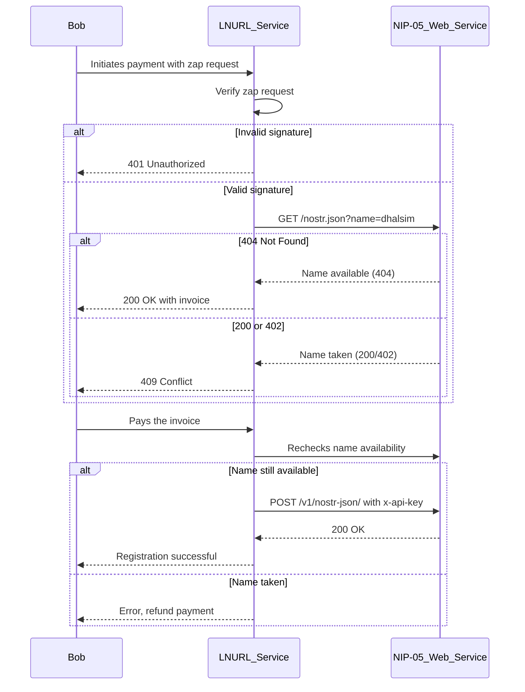
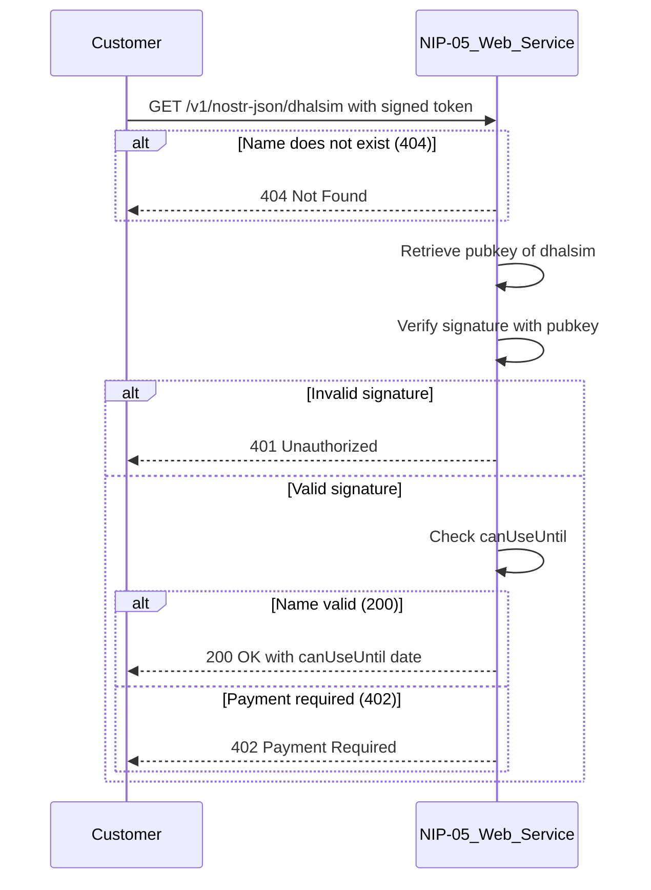
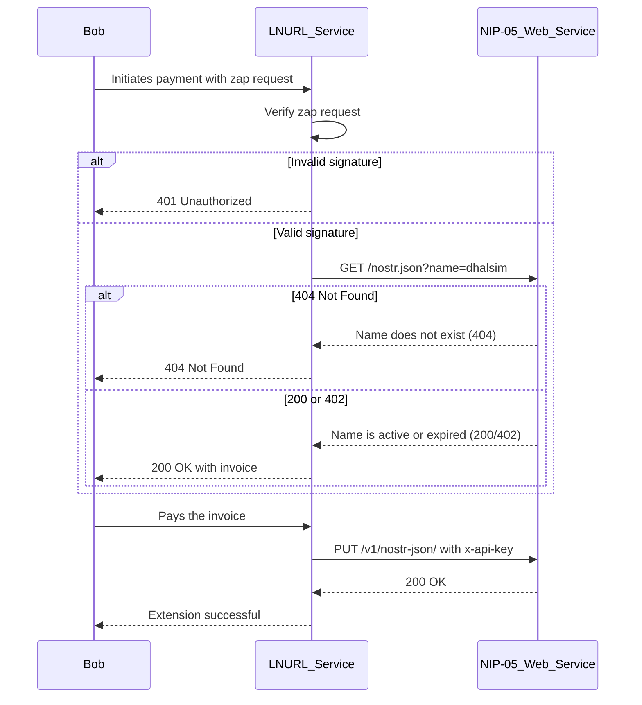

# website

nostrize.me

# build & run

* Build docker image

`docker build -t nostrize-website .`

* Run the container

`docker run --name nostrize-website -p 3005:3005 --env-file .env.local nostrize-website`

`docker run --name nostrize-website -p 3005:3005 --env-file .env.local -v /etc/secrets:/etc/secrets nostrize-website`

# Flows

## Flow 1: Name Registration

1. **Bob initiates a payment** to register a NIP-05 name, specifying the amount he wishes to pay.
1. **LNURL service receives the LNURL-pay request,** including the zap request event encoded in the GET request.
1. **LNURL service verifies the zap request's signature.** If invalid, it returns a `401` Unauthorized response.
1. **LNURL service checks the name availability** by making a GET request to `https://nostrize.me/.well-known/nostr.json?name=dhalsim`.
  * **If 404 (name available):** The service generates an invoice and returns a `200` OK response with the invoice.
  * **If 200 or 402 (name taken):** The service returns a `409` Conflict response indicating the name is already registered.
1. **After payment,** the LNURL service rechecks the name status to ensure it hasn't been registered by someone else.
1. **If the name is still available,** the LNURL service makes a POST request to `/v1/nostr-json/`, including the `name`, `pubkey`, `relays`, and `canUseUntil` in the body, along with the `x-api-key` header for authorization.

## Flow 2: Due Date Check

### Use Case:

Customers can use this API to:
* Check when their NIP-05 name registration will expire (due date).
* Decide if they need to make an additional payment to extend the registration before it expires.
* Understand whether they need to take action (e.g., make a payment) to keep their name active.

### Flow Integration:

* Name Registration Flow: Customers might use this API before registering a new name to see if a name is already taken and how long it is valid.
* Name Extension Flow: Customers can use this API to decide when to extend their registration by checking how much time they have left before their registration expires.

1. **Customer makes a GET request** to `/v1/nostr-json/:name` to check the due date.
  * **If the name does not exist:** Returns `404` Not Found.
1. Customer includes a **signed message** in the request headers, proving ownership of the name.
  * should send `x-message` and `x-signature` in the headers. **They will be validated** against the `pubkey` of the `name`
1. **NIP-05/Web service retrieves the public key** associated with the name.
1. **NIP-05/Web service verifies the signature** using the retrieved public key.
  * **If valid:** The service checks the `canUseUntil` date.
    * **If current time is before canUseUntil:** Returns `200` with a body like `{ "name": "dhalsim", "canUseUntil": "2024-08-27T12:58:34.614Z" }`.
    * **If `canUseUntil` has passed:** Returns `402` Payment Required.
  * **If signature is invalid:** Returns `401` Unauthorized.

## Flow 3: Name Extension

1. **Bob initiates a payment** to extend the registration of his `NIP-05` name.
1. **LNURL service receives the LNURL-pay request,** including the zap request event encoded in the GET request.
1. **LNURL service verifies the zap request's signature.** If invalid, it returns a `401` Unauthorized response.
1. **LNURL service checks the name status** by making a GET request to `https://nostrize.me/.well-known/nostr.json?name=dhalsim`.
  * **If `404` (name does not exist):** The service returns a `404` Not Found response.
  * **If `200` or `402` (name registered):** The service generates an invoice and returns a `200` OK response with the invoice.
1. **After payment,** the LNURL service rechecks the name status to ensure it hasn't been taken by someone else.
1. **If the name is still available,** the LNURL service makes a `PUT` request to `/v1/nostr-json/`, including the `name`, `pubkey`, `relays`, and `canUseUntil` in the body, along with the `x-api-key` header for authorization.

